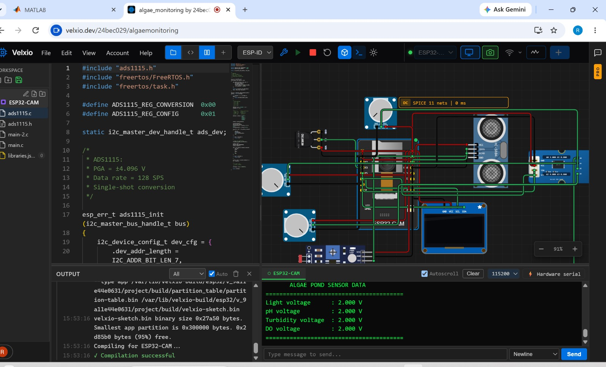

# 🔌 Hardware Implementation

Hardware setup for the Algae-Based Carbon Sequestration Monitoring Platform using **ESP32-CAM** and **ADS1115 ADC**.

## Components

- **ESP32-CAM** — Microcontroller with Wi-Fi and camera
- **ADS1115** — 16-bit ADC for precise analog sensor readings (I2C)
- **Sensors:**
  - Light sensor (analog)
  - pH sensor (analog)
  - Turbidity sensor (analog)
  - Dissolved Oxygen (DO) sensor (analog)

## Circuit & Output



**Screenshot shows:**
- **Left:** ESP-IDF / Velxio firmware code for ADS1115 configuration
- **Right:** Circuit schematic with ESP32-CAM and sensor connections
- **Bottom:** Serial monitor output displaying live algae pond sensor data

## Serial Output Sample

```
ALGAE POND SENSOR DATA
==========================================
Light voltage    : 2.000 V
pH voltage       : 2.000 V
Turbidity voltage: 2.000 V
DO voltage       : 2.000 V
==========================================
```

## Platform

- **IDE:** [Velxio](https://velxio.dev) (ESP-IDF based)
- **Firmware:** C (ESP-IDF / FreeRTOS)
- **Communication:** I2C (ADS1115), Serial (115200 baud)
- **Project Link:** [https://velxio.dev/24bec029/algaemonitoring](https://velxio.dev/24bec029/algaemonitoring)
