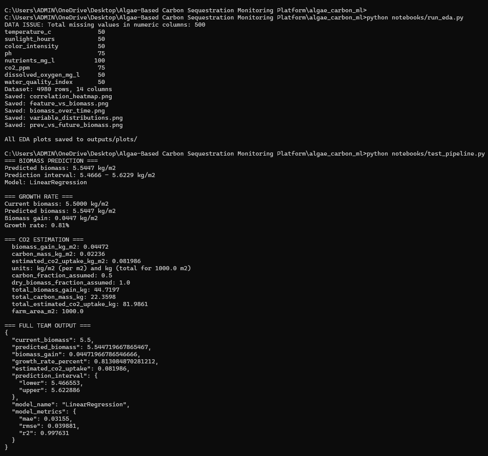

# 🌿 AlgaeGuard — Algae-Based Carbon Sequestration Monitoring Platform

> Real-time monitoring and AI-powered prediction for algae-based carbon capture systems.

Built for **Hackout'26** 🏆

---

## 📋 Overview

AlgaeGuard is an end-to-end platform that monitors algae cultivation systems for carbon sequestration. It combines **IoT sensors**, **AI/ML models**, and an **interactive dashboard** to track biomass growth, estimate CO₂ uptake, and optimize algae farm performance in real time.

## 🏗️ System Architecture


## 📂 Project Structure

```
Algae-Based-Carbon-Sequestration-Monitoring-Platform/
│
├── README.md
├── LICENSE
│
├── report/
│   └── AlgaeGuard_Report_Hackout26.docx
│
├── arduino/
│   └── AlgaeGuard.ino
│
├── ai-ml/
│   └── algae_carbon_ml/
│       ├── data/
│       │   └── algae_synthetic_dataset.xlsx
│       ├── models/
│       ├── notebooks/
│       ├── outputs/
│       ├── src/
│       ├── README.md
│       └── requirements.txt
│
├── dashboard/
│   └── ...
│
├── simulation/
│   └── ...
│
└── images/
    ├── system-architecture.png
    ├── ai-ml-output.png
    ├── carbon-performance.png
    └── dashboard.png
```

## 🔧 Components

### 🔌 Arduino (IoT Sensors)
Hardware interface using Arduino to collect real-time environmental data:
- Temperature, pH, dissolved oxygen
- Light intensity, CO₂ concentration
- Water quality index

### 🤖 AI/ML Module
Machine learning pipeline for biomass prediction and CO₂ uptake estimation:
- **Models**: Linear Regression, Random Forest, Gradient Boosting
- **Best Model**: LinearRegression (R² = 0.9976, MAE = 0.0316)
- Predicts future biomass growth from sensor readings
- Estimates CO₂ sequestration from biomass gain

### 📊 Dashboard
Interactive web dashboard for real-time monitoring and visualization of:
- Live sensor data feeds
- Biomass growth trends
- CO₂ uptake metrics
- Predictive analytics

### 🧪 Simulation
Simulation module for testing and validating the platform without hardware.

## 🚀 Getting Started

### Prerequisites
- Python 3.13+
- Arduino IDE (for hardware component)
- Node.js (for dashboard)

### AI/ML Setup
```bash
cd ai-ml/algae_carbon_ml
pip install -r requirements.txt
```

### Run Predictions
```python
from src.predict import predict_biomass
from src.carbon import estimate_co2_uptake

result = predict_biomass({
    "temperature_c": 29.5,
    "sunlight_hours": 8.0,
    "color_intensity": 245.0,
    "ph": 7.5,
    "nutrients_mg_l": 75.0,
    "co2_ppm": 420.0,
    "dissolved_oxygen_mg_l": 10.5,
    "water_quality_index": 87.0,
    "previous_biomass_kg_m2": 5.5,
})
print(result)
```

## 📈 Model Performance

| Model | MAE | RMSE | R² |
|-------|-----|------|-----|
| **LinearRegression** | 0.0316 | 0.0399 | 0.9976 |
| RandomForestRegressor | 0.0588 | 0.0873 | 0.9887 |
| GradientBoostingRegressor | 0.0614 | 0.0941 | 0.9868 |

## 📸 Screenshots

| AI/ML Output | Carbon Performance |
|:---:|:---:|
|  |  |

| Dashboard |
|:---:|
|  |

## 📄 Report

Detailed project report: [`AlgaeGuard_Report_Hackout26.docx`](report/AlgaeGuard_Report_Hackout26.docx)

## 🛡️ Scientific Disclaimer

- This system is a **prediction prototype**, not a verified CO₂ removal measurement.
- CO₂ uptake is **estimated** from predicted biomass using configurable conversion assumptions.
- All biological parameters are configurable in `ai-ml/algae_carbon_ml/src/config.py`.

## 👥 Team

The Archies

## 📜 License

This project is licensed under the MIT License — see the [LICENSE](LICENSE) file for details.
